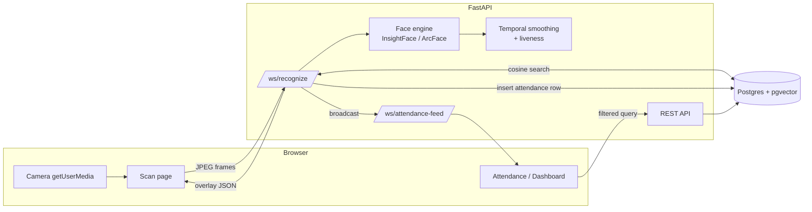

# Attendy — Real-Time Face Recognition Attendance System

A full rewrite of a legacy Flask/OpenCV attendance system, built to fix a real bug
(face recognition that didn't work reliably) and turn a CSV-file prototype into a
properly modeled, real-time, portfolio-grade application.

**Stack:** React · TypeScript · Tailwind CSS (Vite) · FastAPI · SQLAlchemy (async) ·
PostgreSQL + pgvector · InsightFace (ArcFace) · WebSockets · Docker · GitHub Actions

---

## Table of Contents

- [Overview](#overview)
- [Features](#features)
- [Why This Exists](#why-this-exists)
- [Architecture](#architecture)
- [Tech Stack](#tech-stack)
- [Project Structure](#project-structure)
- [API Reference](#api-reference)
- [Getting Started](#getting-started)
- [Environment Variables](#environment-variables)
- [Testing](#testing)
- [Deploying to Neon or Supabase](#deploying-to-neon-or-supabase)
- [Scope & Known Limitations](#scope--known-limitations)
- [Roadmap](#roadmap)

---

## Overview

Attendy is a school attendance system that recognizes students from a live webcam
feed and marks attendance the instant a face is confirmed — with the confirmation
pushed to every open admin dashboard in real time. It replaces a legacy Flask +
OpenCV prototype that used CSV files for storage and a face recognizer that simply
didn't work reliably after training.

## Features

- **Guided face enrollment** — a browser-based burst-capture wizard walks a student
  through several poses (straight, left, right, chin down), extracting a 512-d ArcFace
  embedding per usable capture. No special hardware, just a webcam.
- **Real-time recognition** — live video frames stream over WebSocket to the backend,
  which detects, embeds, and matches faces against stored embeddings via pgvector
  cosine similarity.
- **Temporal smoothing + liveness** — a per-connection face tracker (IoU-based) requires
  5-of-8 consistent frame matches before confirming an identity, plus a
  bounding-box-motion check so a photo held up to the camera can't be marked present.
- **Instant, server-side-filtered attendance sheet** — filter by class, section, date,
  and status, all resolved in SQL — not the dead client-side filter dropdown the
  legacy admin UI shipped with.
- **Live dashboard updates** — confirmed attendance is broadcast over a second
  WebSocket channel and patched directly into the frontend's query cache, so every
  open tab updates without a manual refresh or polling.
- **Analytics** — attendance-rate trend chart and a chronic-absentee list (configurable
  absence-rate threshold), computed over school days only (weekends excluded).
- **Excel export** of the currently filtered attendance sheet.
- **Class/section management**, soft-deletable students, and JWT-based admin auth
  (access + httpOnly refresh token).

## Why This Exists

The original project used OpenCV's **LBPH** face recognizer trained on 1-3
low-resolution photos per student — and enrollment used *different* Haar-cascade
detection parameters than live recognition. That's a bug, not a tuning problem: LBPH
had no chance of generalizing from a handful of static training photos to live webcam
conditions (pose, lighting, distance).

Rather than patch LBPH, this project replaces:

- the **recognition engine** — ArcFace embeddings (InsightFace) + pgvector similarity
  search, with enrollment and live recognition sharing the exact same
  capture/detection code path by construction, so the two can't drift apart again;
- the **data layer** — CSV files → a normalized Postgres schema with a proper
  `attendance_records` event log (absence is the *absence* of a row, never written);
- the **frontend** — server-rendered Flask templates → React + Tailwind.

One part of the legacy design was genuinely good and is deliberately kept: temporal
smoothing across multiple frames before ever trusting a single recognition result.

## Architecture



Full system design, the event-log data model, and the reasoning behind harder
decisions (browser-side camera capture, WebSockets over SSE, why an event log instead
of a status column) live in [`docs/ARCHITECTURE.md`](docs/ARCHITECTURE.md).

## Tech Stack

| Layer | Technology |
|---|---|
| Frontend | React 19, TypeScript, Tailwind CSS v4, Vite, TanStack Query, Zustand, React Hook Form + Zod, Recharts |
| Backend | FastAPI, SQLAlchemy 2.0 (async), Pydantic v2, PyJWT, bcrypt, Alembic |
| Face recognition | InsightFace (`buffalo_l` / ArcFace), ONNX Runtime, OpenCV (headless) |
| Database | PostgreSQL 16 + [`pgvector`](https://github.com/pgvector/pgvector) (HNSW cosine index) |
| Real-time | Native FastAPI/Starlette WebSockets |
| Testing | pytest + pytest-asyncio (isolated test database), Vitest + React Testing Library |
| Infra | Docker, Docker Compose, nginx (frontend reverse proxy), GitHub Actions CI |

## Project Structure

```
attendy-v2/
├── backend/
│   ├── app/
│   │   ├── api/routes/       # REST endpoints: auth, students, class_sections, attendance
│   │   ├── core/             # settings (pydantic-settings) and JWT/password security
│   │   ├── db/
│   │   │   └── models/       # SQLAlchemy models: admin, student, class_section,
│   │   │                     #   face_embedding (pgvector), attendance
│   │   ├── schemas/          # Pydantic request/response schemas
│   │   ├── services/         # face_engine, matcher (pgvector search), tracker
│   │   │                     #   (temporal smoothing + liveness), attendance_service,
│   │   │                     #   analytics_service, export_service (xlsx)
│   │   ├── ws/                # /ws/recognize and /ws/attendance-feed handlers
│   │   └── main.py
│   ├── alembic/               # DB migrations (incl. `CREATE EXTENSION vector`)
│   ├── scripts/               # seed_admin, calibrate_threshold, WS smoke test
│   ├── tests/                 # pytest: unit/ + integration/ (own isolated DB)
│   └── Dockerfile
├── frontend/
│   └── src/
│       ├── routes/
│       │   ├── login/
│       │   └── admin/
│       │       ├── dashboard/    # trend chart + chronic-absentee list
│       │       ├── attendance/   # filterable, live-updating sheet + export
│       │       ├── students/     # CRUD + face enrollment wizard
│       │       └── scan/         # live camera + recognition overlay
│       ├── components/{layout,common}/
│       ├── hooks/                 # React Query hooks incl. the WS feed cache-patcher
│       ├── lib/                   # axios client (auto refresh), query client
│       └── store/                 # Zustand auth store
├── docs/
│   ├── ARCHITECTURE.md
│   └── NEON_SUPABASE_SWAP.md
├── docker-compose.yml          # db + adminer always; backend + frontend under `full` profile
└── .github/workflows/ci.yml
```

## API Reference

All routes except `/api/auth/login`, `/api/auth/refresh`, and `/api/health` require a
bearer token.

| Method | Path | Purpose |
|---|---|---|
| POST | `/api/auth/login` | Authenticate, returns access token + sets refresh cookie |
| POST | `/api/auth/refresh` | Exchange refresh cookie for a new access token |
| POST | `/api/auth/logout` | Clear the refresh cookie |
| GET | `/api/auth/me` | Current admin profile |
| GET / POST | `/api/class-sections` | List / create class-sections |
| DELETE | `/api/class-sections/{id}` | Delete a class-section |
| GET / POST | `/api/students` | List (filterable) / create students |
| GET / PATCH / DELETE | `/api/students/{id}` | Read / update / soft-delete a student |
| POST | `/api/students/{id}/enroll-face` | Upload burst-capture photos → store embeddings |
| DELETE | `/api/students/{id}/face-embeddings` | Clear stored embeddings (re-enroll) |
| GET | `/api/attendance` | Filterable attendance sheet (date, class, status, search) |
| POST | `/api/attendance/manual` | Admin override (mark present/absent for a date) |
| GET | `/api/attendance/export` | Export the filtered sheet as `.xlsx` |
| GET | `/api/attendance/analytics/summary` | Daily present/absent counts over a date range |
| GET | `/api/attendance/analytics/chronic-absentees` | Students over an absence-rate threshold |
| WS | `/ws/recognize` | Bidirectional: JPEG frames in, recognition overlay + attendance marks out |
| WS | `/ws/attendance-feed` | Broadcast channel: live `attendance_confirmed` events |
| GET | `/api/health` | Health check |

## Getting Started

### Fastest path — fully containerized

```bash
cd attendy-v2
docker compose --profile full up --build

# in a second terminal, once the backend container is healthy:
docker compose exec backend alembic upgrade head
docker compose exec backend python -m scripts.seed_admin --email admin@attendy.dev --name "Admin" --password admin123
```

Open `http://localhost:8080`. First run downloads the ~300MB InsightFace `buffalo_l`
model pack.

### Day-to-day development (native processes, faster iteration)

```bash
# 1. Database only
docker compose up -d db

# 2. Backend
cd backend
python -m venv venv && source venv/Scripts/activate   # venv/bin/activate on macOS/Linux
pip install -r requirements.txt
alembic upgrade head
python -m scripts.seed_admin --email admin@attendy.dev --name "Admin" --password admin123
uvicorn app.main:app --reload

# 3. Frontend
cd frontend
npm install
npm run dev
```

Open the printed Vite dev URL (default `http://localhost:5173`).

## Environment Variables

Copy `backend/.env.example` to `backend/.env` and adjust as needed — every value has a
working local-dev default baked into `app/core/config.py`, so a fresh clone runs
without a `.env` at all:

| Variable | Default | Purpose |
|---|---|---|
| `DATABASE_URL` | local Docker Postgres | SQLAlchemy async connection string |
| `JWT_SECRET` | dev placeholder | **Change this in any real deployment** |
| `JWT_ALGORITHM` | `HS256` | JWT signing algorithm |
| `ACCESS_TOKEN_EXPIRE_MINUTES` | `30` | Access token lifetime |
| `REFRESH_TOKEN_EXPIRE_DAYS` | `7` | Refresh token lifetime |
| `CORS_ORIGINS` | `["http://localhost:5173"]` | Allowed frontend origins |
| `FACE_MATCH_THRESHOLD` | `0.38` | Cosine-similarity cutoff for a face match |
| `FACE_MODEL_PACK` | `buffalo_l` | InsightFace model pack |

## Testing

```bash
# Backend — spins up an isolated `attendy_test` database automatically, so it never
# touches your dev data
cd backend && pytest -v

# Frontend
cd frontend && npm run test
```

CI (`.github/workflows/ci.yml`) runs both suites plus lint (`ruff`, `oxlint`) and both
production builds on every push/PR to `main`.

## Deploying to Neon or Supabase

Both are wire-compatible Postgres and support `pgvector`, so switching from the local
Docker database is a `DATABASE_URL` change, not a code change — see
[`docs/NEON_SUPABASE_SWAP.md`](docs/NEON_SUPABASE_SWAP.md).

## Scope & Known Limitations

- **Liveness** is a bounding-box-motion heuristic, not a production anti-spoofing
  model — enough to block a photo held up to the camera, not a security control.
- **Auth** is a single access/refresh JWT pair with no rotation or session-revocation
  list — appropriate for a single-admin deployment, not multi-tenant SaaS.
- **Single-instance real-time**: the WebSocket broadcast manager is in-process
  (appropriate at this scale); a multi-instance deployment would swap it for Redis
  pub/sub without changing calling code.
- **CPU-only inference** is adequate for a single-camera admin/kiosk setup, not sized
  for many concurrent camera streams.

## Roadmap

- Library issue/return tracking and mid-day-meal tracking (present in the legacy app,
  intentionally not ported yet — this rewrite focused on making the attendance module
  solid first) using the same face/DB/API/UI patterns established here.
- PDF export alongside the existing Excel export.
- Email/SMS absence notifications to parents.
