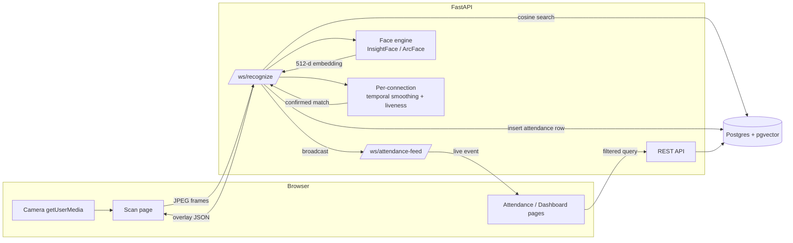

# Architecture

## System overview

## Why the legacy system broke

The original Flask app used OpenCV's LBPH recognizer trained on 1-3 low-resolution,
inconsistently-cropped photos per student (enrollment and live recognition even used
*different* Haar cascade parameters). LBPH cannot generalize from a handful of static
images to live webcam conditions -- pose, lighting, and distance all shift the match
distance past whatever threshold you pick. This rewrite replaces the whole approach
rather than tuning it further.

## Face recognition pipeline

- **Enrollment** (`FaceEnrollWizard` → `POST /api/students/{id}/enroll-face`): the
  browser burst-captures ~10-15 stills through guided pose prompts, using the *same*
  camera/detection code path as live recognition -- eliminating the enrollment/live
  mismatch by construction, not by tuning. Each usable capture becomes its own 512-d
  ArcFace embedding row in `face_embeddings` (pgvector `vector(512)` column); there is
  no "training" step, since ArcFace is a fixed pretrained model.
- **Recognition** (`WS /ws/recognize`): each frame is embedded, then matched via
  `ORDER BY embedding <=> :query` (pgvector cosine distance) against every stored
  embedding.
- **Temporal smoothing**: a genuinely good idea carried over from the legacy code,
  just re-fed. Each open `/ws/recognize` connection tracks faces frame-to-frame by IoU
  overlap, keeps a rolling window of the last 8 recognitions per tracked face, and only
  confirms an identity once 5 of those 8 agree above the similarity threshold. This is
  what makes recognition robust to single-frame noise (blinks, angle, a stray shadow)
  without needing hair-trigger thresholds.
- **Liveness**: confirmation additionally requires the tracked face's bounding-box
  center to have drifted a few pixels across the window -- a photo held perfectly still
  won't pass. This is a deliberately lightweight heuristic, not a production
  anti-spoofing model (see the main README's scope notes).

## Attendance data model

`attendance_records` is an **event log** -- one row per confirmed presence,
`UNIQUE(student_id, event_date)`, inserted via `INSERT ... ON CONFLICT DO NOTHING`.
Absence is the *absence of a row*, never written. Both the "who just got marked"
real-time feed and the filterable present/absent sheet read from this single table
(`students LEFT JOIN attendance_records ON ... AND event_date = :date`), so there is
exactly one write path into attendance truth -- the sheet cannot go stale relative to
what the camera confirmed, because there's no second table that could disagree with it.

## Real-time flow

`/ws/recognize` and `/ws/attendance-feed` are separate WebSocket channels. The scan
page's confirmed detections are written to the DB and broadcast (via an in-process
`ConnectionManager`) to every open `/ws/attendance-feed` connection; the Attendance page
patches its TanStack Query cache in place on receipt (`setQueryData`, not
`invalidateQueries`), so a filtered view updates live without a network round-trip.
